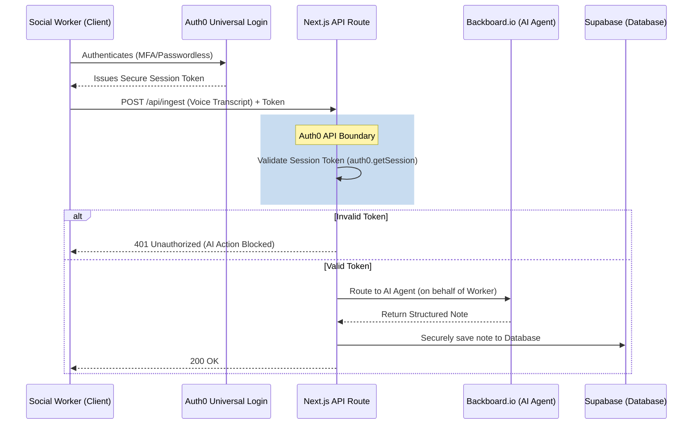
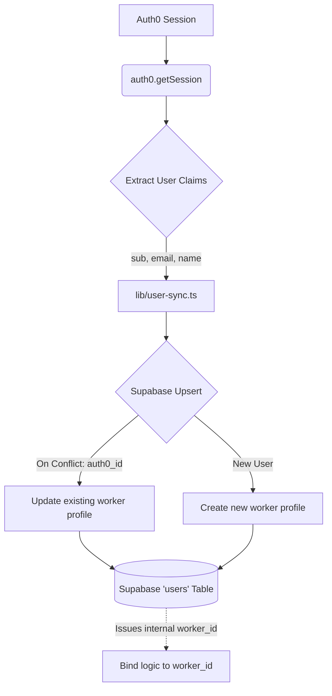

# Auth0 Integration: Securing Waypoint

At the core of the **Waypoint** platform for social workers is our integration with **Auth0**. Because Waypoint manages highly sensitive, HIPAA and PIPEDA-compliant social work cases, security cannot be an afterthought. 

We didn't just use Auth0 for a simple login screen; we integrated it as the absolute **API Boundary** for our entire application, ensuring that our AI agents (powered by Backboard and Gemini) only ever operate on behalf of verified, authorized human users.

---

## 🚀 The Foundation: Universal Login & Next.js App Router

We leverage the `@auth0/nextjs-auth0` SDK tightly coupled with the Next.js App Router. This allows us to protect both frontend server components and backend API routes seamlessly.

Instead of building custom authentication flows, we rely on **Auth0 Universal Login**. This provides us with immediate, out-of-the-box support for:
- Passwordless Authentication
- Multi-Factor Authentication (MFA)
- Enterprise Federation (for municipal active directories)

This ensures that social workers—who often access the system from shared municipal devices or personal mobile phones in the field—are authenticated through an industry-standard, battle-tested gateway.

---

## 🛡️ The API Boundary: Securing AI Agents

The most critical aspect of our Auth0 integration is how it governs our AI architecture. Waypoint utilizes orchestrated AI agents to transcribe voice notes, summarize files, and analyze multi-year case histories.

**If an AI agent can read and write to a client's case file, that agent's access must be strictly gated by human authorization.**

Every single route in our `app/api/` directory (e.g., `/api/ingest`, `/api/chat`, `/api/clients`) enforces an absolute Auth0 session check before any database or Backboard.io action is allowed:

```typescript
// Example: The API Boundary
import { auth0 } from "@/lib/auth0";

export async function POST(request: NextRequest) {
  const session = await auth0.getSession(request);
  if (!session?.user) {
    return NextResponse.json({ error: "Unauthorized" }, { status: 401 });
  }
  
  // Backboard AI Action proceeds only on behalf of session.user...
}
```

### The "Secure AI Agents" Data Flow



---

## 🔄 Identity Syncing: Auth0 `sub` to Supabase Profiles

While Auth0 manages the authentication lifecycle, our application logic and relational data live in Supabase. To bridge this gap, we implemented a seamless syncing mechanism in `lib/user-sync.ts`.

When a social worker logs in via Auth0, the application intercepts the session and synchronizes the Auth0 `sub` (subject identifier) with a permanent profile record in our Supabase `users` table.

This allows us to leverage Auth0 for security while maintaining referential integrity in our database for assigning cases, tracking audit logs, and mapping Google Calendar credentials.



---

## 🔮 Future-Proofing: Human-in-the-Loop Async Authorization

Because we treat Auth0 as our identity backbone, Waypoint is architecturally positioned to adopt advanced delegated permission models, specifically the upcoming **Auth0 AI SDK** patterns like `withAsyncAuthorization()`.

As Waypoint evolves to allow autonomous agents to take higher-risk actions (e.g., automatically dispatching a crisis intervention team, or syncing notes to a legacy provincial database), standard session tokens won't be enough.

**The Target Architecture:**
When an AI agent proposes a high-risk mutation, the backend will trigger an Auth0 CIBA/RAR (Client Initiated Backchannel Authentication) push notification. The action is held in suspense. Only when the social worker taps **"Approve"** on their mobile device will Auth0 issue the scoped execution token, allowing the AI agent to proceed.

By establishing Auth0 at the absolute perimeter today, Waypoint ensures that our AI remains an *assistant*, not an unsupervised actor, keeping social workers firmly in control of the care narrative.
