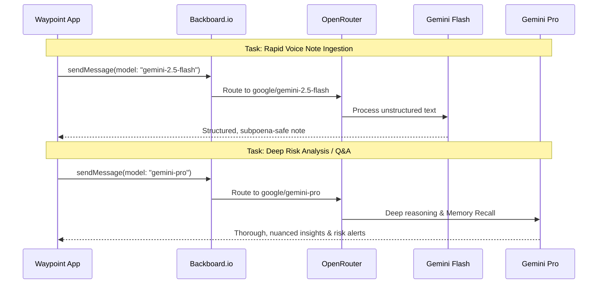
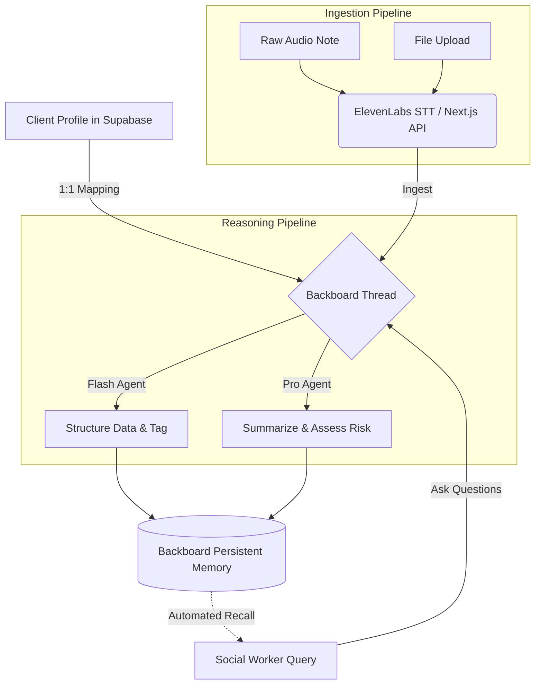

# Backboard.io Integration: Architecting "Waypoint"

At the core of the **Waypoint** platform for social workers is our integration with **Backboard.io**. We didn't just use Backboard as a simple AI wrapper; we leveraged its deep memory features, custom model routing, and persistent threads to create a system that acts as a continuous, omniscient collaborator for case workers.

---

## 🚀 Our Innovation: Dynamic Dual-Model Routing via OpenRouter

While a standard Backboard implementation might default to a single LLM (like GPT-4o) for all tasks, social work requires both **speed** (for quickly ingesting field notes) and **nuance** (for deep risk assessment). 

**Our innovation is overriding Backboard's default routing per-message to utilize a dual-model Gemini architecture.**

By hooking into Backboard's OpenRouter integration, we created custom `ModelConfig` definitions in our `lib/backboard.ts` layer:

1. **Gemini 2.5 Flash (`google/gemini-3-flash-preview`)**: Triggered automatically for fast, cost-effective ingestion of messy field notes or voice transcriptions. It structures the data into objective, subpoena-safe formats instantly.
2. **Gemini Pro (`google/gemini-3.1-pro-preview`)**: Triggered for complex Q&A and risk-aware overviews, providing deep reasoning over the client's entire stored case history.

This dynamic approach gives us the best of both worlds: lightning-fast UI responsiveness during data entry, and profound analytical depth during case review—all managed transparently by Backboard's threading wrapper.

---

## 🧠 Persistent Contextual Memory

In social work, continuity of care is paramount. When case workers change or when reviewing a client's multi-year history, vital context is often lost in fragmented PDF files and disjointed databases. 

We utilized Backboard's **Threads and Memories API** to solve this:

- Every client in our database is bound 1:1 with a unique **Backboard Thread ID**.
- Whenever a new document is uploaded, a note is taken, or an audio transcript is generated, it is automatically pushed into the designated Backboard thread with specific metadata tags (e.g., `HOUSING`, `SUBSTANCE_USE`, `MENTAL_HEALTH`).
- Because Backboard handles the heavy lifting of RAG (Retrieval-Augmented Generation) and vectorization via `text-embedding-3-large`, the system maintains a "long-term memory" of the client's entire journey.

---

## 🛡️ Beyond Generic Chat: Subpoena-Safe Structuring

Instead of just using Backboard for a "chat interface", we utilize it as an automated **ETL (Extract, Transform, Load) pipeline** for human text. 

Using tailored system prompts mapped to our "Waypoint Case Worker" assistant, every piece of information sent to Backboard is first scrubbed of subjective bias and restructured into an objective, factual format. 

### The Workflow:

1. **Raw Input**: *"The client was acting super crazy today and their apartment was a massive mess, I think they are using again."*
2. **Backboard Processing**: The `sendMessage` function passes the input to the Gemini model with strict formatting constraints.
3. **Structured Output**:
  - **Observation**: "Client exhibited erratic behavior. Residence observed to be heavily disorganized."
  - **Tags**: `[MENTAL_HEALTH]`, `[HOUSING]`
  - **Risk Level**: `MED`
4. **Storage**: This objective note is saved to Supabase for the UI and natively embedded into Backboard's memory for future contextual Q&A.

By deeply integrating Backboard.io's advanced capabilities—specifically OpenRouter dual-model routing and persistent assistant memory—Waypoint transforms fragmented social work data into a continuous, intelligent, and highly secure care narrative.