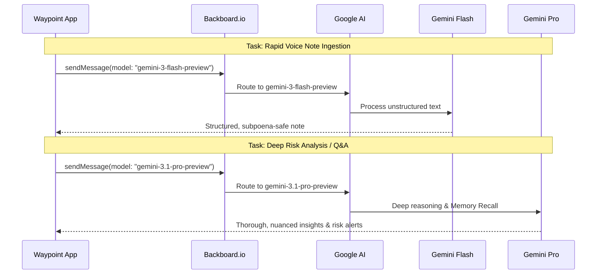
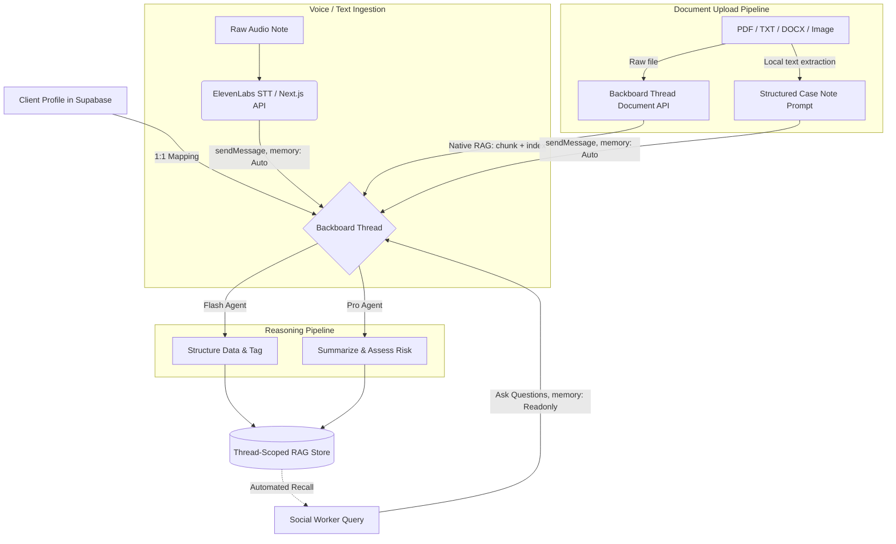
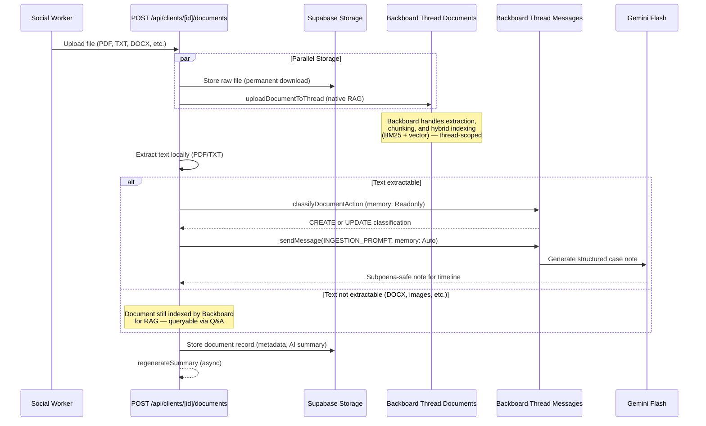

# Backboard.io Integration: Architecting "Waypoint"

At the core of the **Waypoint** platform for social workers is our integration with **Backboard.io**. We didn't just use Backboard as a simple AI wrapper; we leveraged its deep memory features, custom model routing, and persistent threads to create a system that acts as a continuous, omniscient collaborator for case workers.

---

## 🚀 "Innovation" (1): Dynamic Dual-Model Routing via Google Provider

While a standard Backboard implementation might default to a single LLM (like GPT-4o) for all tasks, social work requires both **speed** (for quickly ingesting field notes) and **nuance** (for deep risk assessment). 

**Our innovation is overriding Backboard's default routing per-message to utilize a dual-model Gemini architecture.**

By hooking into Backboard's native Google integration, we created custom `ModelConfig` definitions in our `lib/backboard.ts` layer:

1. **Gemini 3 Flash (`gemini-3-flash-preview`)**: Triggered automatically for fast, cost-effective ingestion of messy field notes or voice transcriptions. It structures the data into objective, subpoena-safe formats instantly.
2. **Gemini 3 Pro (`gemini-3.1-pro-preview`)**: Triggered for complex Q&A and risk-aware overviews, providing deep reasoning over the client's entire stored case history.

This dynamic approach gives us the best of both worlds: lightning-fast UI responsiveness during data entry, and profound analytical depth during case review—all managed transparently by Backboard's threading wrapper.

---

## 🧠 Persistent Contextual Memory

In social work, continuity of care is paramount. When case workers change or when reviewing a client's multi-year history, vital context is often lost in fragmented PDF files and disjointed databases. 

We utilized Backboard's **Threads and Memories API** to solve this:

- Every client in our database is bound 1:1 with a unique **Backboard Thread ID**.
- Whenever a new document is uploaded, a note is taken, or an audio transcript is generated, it is automatically pushed into the designated Backboard thread with specific metadata tags (e.g., `HOUSING`, `SUBSTANCE_USE`, `MENTAL_HEALTH`).
- Because Backboard handles the heavy lifting of RAG (Retrieval-Augmented Generation) and vectorization via `text-embedding-3-large`, the system maintains a "long-term memory" of the client's entire journey.

---

## 📄 Document Upload → Thread-Scoped RAG

Social workers frequently need to import existing client data—court notices, medical records, eviction letters, benefit statements—from past systems or external agencies. These documents must be accessible to the AI when answering questions or generating risk assessments, but **scoped strictly to the individual client**.

### Why Thread-Level Documents Over Assistant-Level Memory

Backboard's memory architecture has a critical distinction:

| Mechanism | Scope | Use Case |
|-----------|-------|----------|
| `addMemory()` | **Assistant-level** — shared across all threads | General facts the assistant should know globally |
| `POST /threads/{id}/documents` | **Thread-level** — isolated to one thread | Client-specific documents that must not leak across clients |
| `sendMessage(memory: "Auto")` | **Assistant-level** extraction from thread context | Structured notes and conversational context |

For privacy-sensitive social work data, we use Backboard's **thread-level document upload** (`uploadDocumentToThread`) so that a document uploaded to Client A's profile is only retrievable within Client A's thread. It cannot influence responses about Client B.

### The Document Ingestion Pipeline

### Dual-Path Context Integration

Each uploaded document enters the client's Backboard thread through **two complementary paths**:

1. **Native Thread Document** — The raw file is uploaded directly to Backboard's thread document store via `POST /threads/{threadId}/documents`. Backboard handles extraction, chunking, and indexing using its hybrid search system. This is the **primary RAG source** for future Q&A queries and is fully thread-scoped.

2. **Structured Case Note** (PDF/TXT only) — Text is extracted locally and processed through a classification + ingestion prompt to produce a human-readable, subpoena-safe case note. This note is sent to the thread with `memory: "Auto"`, making the AI's interpretation of the document available as conversational context.

This dual-path ensures both the **raw document data** (for precise retrieval) and the **AI's structured interpretation** (for the timeline and risk assessment) are captured in the client's thread.

### Classification: CREATE vs UPDATE

Before generating a case note, the system asks the AI (with `memory: "Readonly"` to avoid polluting context) whether the document:

- **CREATE**: Introduces a new development (e.g., a new eviction notice → new housing risk note)
- **UPDATE**: Adds evidence to an existing case issue (e.g., a court reschedule → updates existing legal timeline)

This classification is embedded in the ingestion prompt so the AI can frame the note appropriately.

---

## 🛡️ Beyond Generic Chat: Subpoena-Safe Structuring

Instead of just using Backboard for a "chat interface", we utilize it as an automated **ETL (Extract, Transform, Load) pipeline** for human text. 

Using tailored system prompts mapped to our "Waypoint Case Worker" assistant, every piece of information sent to Backboard is first scrubbed of subjective bias and restructured into an objective, factual format. 

### The Workflow:

1. **Raw Input**: *"The client was acting super crazy today and their apartment was a massive mess, I think they are using again."*
2. **Backboard Processing**: The `sendMessage` function passes the input to the Gemini model with strict formatting constraints.
3. **Structured Output**:
  - **Observation**: "Client exhibited erratic behavior. Residence observed to be heavily disorganized."
  - **Tags**: `[MENTAL_HEALTH]`, `[HOUSING]`
  - **Risk Level**: `MED`
4. **Storage**: This objective note is saved to Supabase for the UI and natively embedded into Backboard's memory for future contextual Q&A.

By deeply integrating Backboard.io's advanced capabilities—specifically Google native dual-model routing and persistent assistant memory—Waypoint transforms fragmented social work data into a continuous, intelligent, and highly secure care narrative.